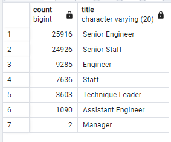
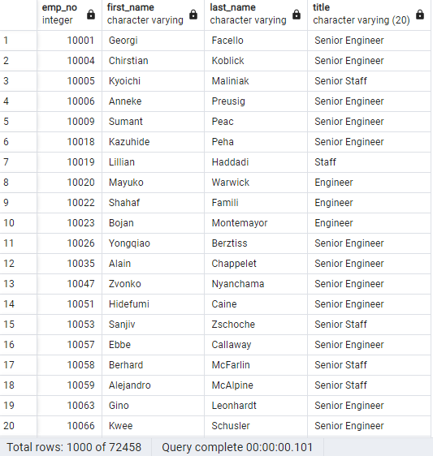
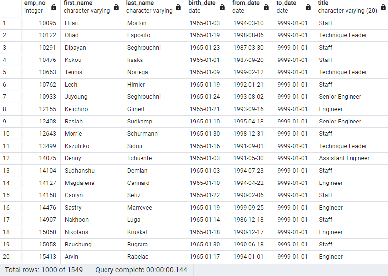

# Pewlett Hackard Analysis

## Purpose of Analysis

Pewlett Hackard needed to review the upcoming retirements of their current workforce
so that they'd be better equipped to understand their future needs.  We broke down the
part of their current workforce that is set to retire over the next couple of years.
This will give Pewlett Hackard the ability to hire new employees and also use the
exisiting workforce set to retire soon to become mentors for the next wave of employees.

## Results

* There are over 70,000 employees set to retire

* Senior staff is the most effected as Senior Engineering and Senior Staff are set to lose 
over 24,000 each.

* Our solution to this issue is to create a mentorship programing that our current
employees that are set to retire can participate in and mentor the new employees.

* Pewlett Hackard has over 1500 employees that can take part in this mentorship program. We
just set up the mentorship parameters if they are within two years of retirement.

## Summary 

* how many roles will need to be filled as the "silver tsunami" begins? 
There are 72,458 roles that will need to be filled.

* Are there enough qualified, retirment ready employees in the departments to mentor the next generation?

It doesn't appear that Pewlett Hackard has enough current employes set to assist in the mentorship program.
There is only 1549 current employees that qualify for the mentorship program.  We'll need to expand the
search to more than just the employees set to retire in two years. 

